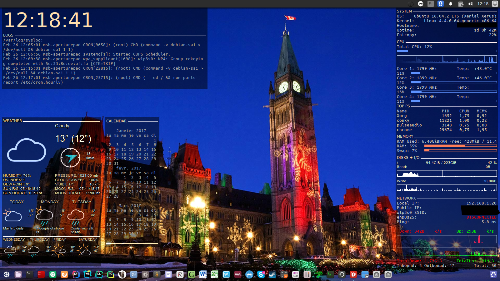

# conky-config
This project is an example of a conky config uncluding :
  - system logs
  - cpu monitoring
  - ram monitoring
  - disk i/o monitoring
  - network monitoring
  - simple calendar
  - weather

The display is half english and french for some elements and adapted to my 1600*900 resolution. This configuration is really inspired from [mtking2 / conky-config](https://github.com/mtking2/conky-config) and shows how to implement accuweather scripts.

## Usage
Just launch the *start.sh* located in the conky folder. Don't forget to `chmod +x start.sh` before you execute it.

All rc files available are not executed in my config but you can customize it. See the repository mentioned above.

## Repository folders
  - **img** folder contains images to display in .md
  - **conky** folder contains all config rc files to display what you can see in the example above :
    - *calrc* for calendar
    - *syslogrc* for clock and system logs
    - *systemrc* for system info
    - *cpurc* for cpu info
    - *memoryrc* for ram
    - *diskrc* for disk io
    - *networkrc* for network monitoring
    - **1_accuweather folder** for weather display, see part below for more info

## Adapting the network display to your install
I use this configuration on Ubuntu 16.04 and my configuration automatically adapts to my two network interfaces : *wlp3s0* for wifi and *enp0s25* for ethernet cable. Go to the **networkrc** file and change these interfaces with your system's.

## Adapting the weather display to your install
I use the *.conkyrc_1_images_wind_2016* file for my configuration, but there are a lot others you can have fun with. I got this from the accuweather scripts : [see this link](https://forums.bunsenlabs.org/viewtopic.php?id=189)

If you want to use my configuration as it is, you have to change two files :
  - *1_accuweather executable*
  - *.conkyrc_1_images_wind_2016*

In these files replace the **$HOME/Programs/conky/1_accuweather** with your location of the conky install.

Then, follow the instructions from *conky/1_accuweather/1_README_INFO* to adapt the script to your location and have a correct display.

Hope this helps !
